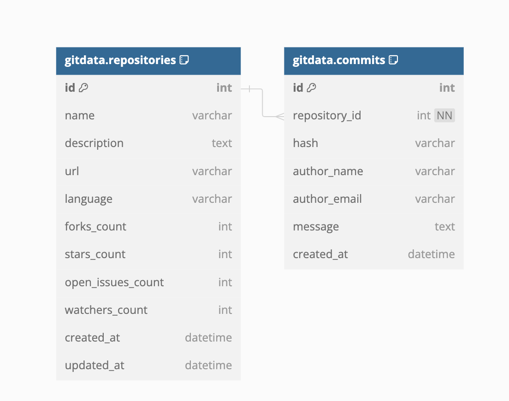

# Github Action Monitoring service

This project fetches and stores GitHub commit data using TypeScript, Express, and TypeORM.

## Setup

### 1. Clone the Repository

Clone the repository to your local machine:

```bash
git clone https://github.com/Ayomisco/gh-monitor-service.git
cd https://github.com/Ayomisco/gh-monitor-service.git
```

### 2. Install Dependencies

Install the required dependencies:

```npm install
```

### 3. Create a .env File
Create a .env file in the project root directory:

``` touch .env
```
Add the following content to the .env file:

```
GITHUB_API_TOKEN=your_github_token
DATABASE_PATH=./database.sqlite
POLLING_INTERVAL=3600000
```

### 4 Scripts
Update your package.json with the following scripts:
```{
  "scripts": {
    "start": "ts-node src/index.ts",
    "build": "tsc",
    "test": "jest",
    "dev": "nodemon src/index.ts"
  }
}
```

### Run and Test

Build the Project
Compile the TypeScript code:

``` npm run build
```

 Start the Server
Start the server:

```npm start ```

Testing
To execute the tests, run:

```npm test```


Database Schema
The database schema for this project is illustrated in the image below. You can find it in the project directory.

